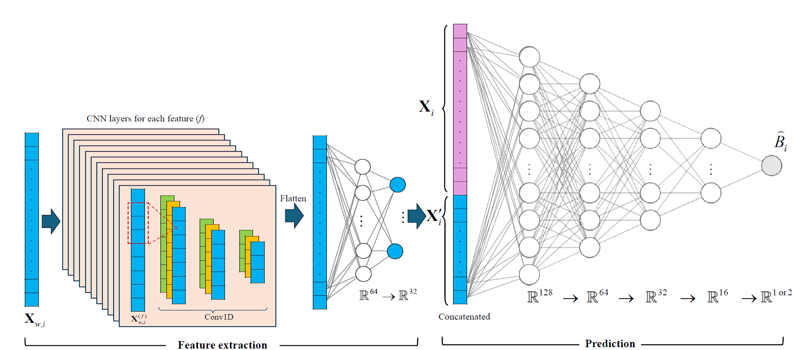
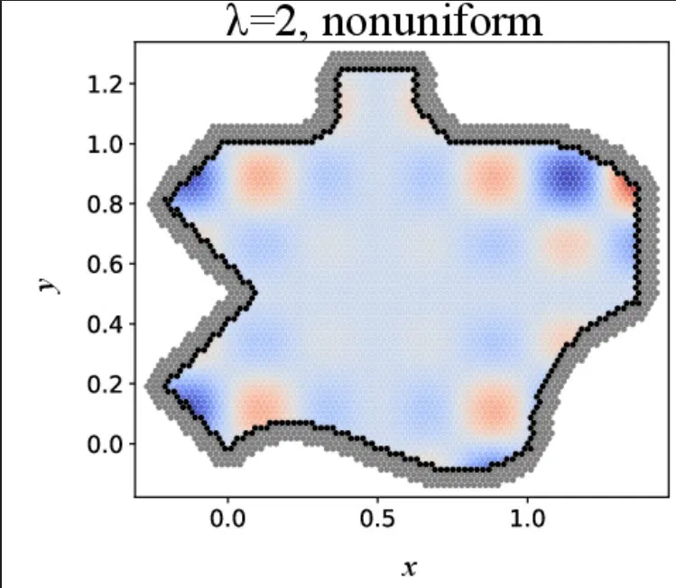

# ML-Based Boundary Treatment for MPS

This repository accompanies the paper:

> **A Machine Learning-based Solid Boundary Treatment for Meshfree Particle Methods**
> Nariman Mehranfar, Ahmad Shakibaeinia
> *Department of Civil, Geological, and Mining Engineering, Polytechnique Montréal, Montreal, Canada*

Inference-only workflow for the trained neural networks that predict the
ghost-particle contribution to MPS differential operators. Training is **not**
included: the trained `.h5` models are loaded, run on the test data, and their
predictions are compared against ground truth.

The five operators (referred to below as `<operator>`) are:

```
n0 | gradientScalar | laplacianScalar | divergenceVector | laplacianVector
```
## Neural Network Architecture



Each operator has its own trained network: a hybrid **CNN–MLP** that predicts the
boundary correction term $\hat{B}_i$ — the contribution that the ghost particles
would have supplied to the MPS approximation of that operator at a near-wall
particle $i$. The full operator value is then recovered as $A_i + \hat{B}_i$,
where $A_i$ is the contribution of the surrounding fluid and wall particles. The
network is fed two kinds of input: a set of per-neighbour *stencil* sequences for
the CNN, and one flat (*wide*) vector of all physics-inspired features for the
MLP.

The CNN acts as a local feature extractor over the $N = 9$ nearest wall
particles. Each per-neighbour feature is arranged as a length-9 sequence (6 such
sequences for number density `n0`, 11 for the scalar operators, and 12 for the
vector operators), and these pass through three 1-D convolutional layers (three
filters of size 3 each) followed by two dense layers of 64 and 32 units. The
flattened result is concatenated with the wide feature vector — fusing the
learned geometric pattern with the raw physics features — and passed to a
four-layer MLP predictor (128 → 64 → 32 → 16 → output). The feature extractor
uses `ELU` activations and the predictor uses `ReLU`, with `He normal` kernel
initialisation and a linear output that is scalar or vector depending on the
operator.

The size of the wide input vector differs per operator and is exactly what each
loaded `.h5` model expects: 61 for `n0`, 109 for `gradientScalar`, 108 for
`laplacianScalar`, 118 for `divergenceVector`, and 119 for `laplacianVector`.
This repository performs inference only — it rebuilds each network from its
`.h5` files and runs it; the training procedure is not included.

---

## 1. What's in the source

### Code

| File | What it is / generates |
|------|------------------------|
| `common_pipeline.py` | Shared preprocessing and metrics used by both scripts (CSV loading, feature engineering, column selection, CNN-group ordering, WG reconstruction, error metrics). Imported as a library — produces nothing on its own. No TensorFlow dependency. |
| `1_save_normalization.py` | **Run once.** Reads the training data a single time and computes the normalization coefficients (per-feature mean / scale) for **all five operators**. Generates the `normalization_weights/` folder. Needs only `numpy`, `pandas`, `scikit-learn`. |
| `2_predict_and_compare.py` | **Inference.** Loads the test data + the saved coefficients + the trained `.h5` model for one operator, predicts, and compares against ground truth. Generates the `output/<operator>/` folder. Needs `numpy`, `pandas`, `matplotlib`, `tensorflow`. |

### Data (`data/`)

| File | What it is |
|------|------------|
| `dataForTrainingAndValidation.tar.xz` | Compressed training+validation data (~1.2 GB) — **hosted externally** (too large for the repository): download it from [Zenodo](https://zenodo.org/records/20455453), place it in `data/`, and **extract it to `dataForTrainingAndValidation.csv` before step 1.** Used only to fit the normalization coefficients. |
| `test_near_wall.csv` | Near-wall test particles — the points that are actually predicted and scored. |
| `test_not_near_wall.csv` | Background (non-near-wall) points, used only as context in the spatial plots. |
| `feature_description.md` | Reference description of the input/output columns. |

The test data here corresponds to **Case 1** (the predefined-field case) used for the prediction test.



### Models (`model/`)

Trained Keras networks, one **pair** per operator: the full model `<stem>.h5`
(structure) and `<stem>_weights.h5` (weights). The stem is derived from the
operator's output columns:

| `<operator>` | model stem in `model/` |
|--------------|------------------------|
| `n0`               | `n0OG` |
| `gradientScalar`   | `gradientScalarOGAll` |
| `laplacianScalar`  | `laplacianScalarOG` |
| `divergenceVector` | `divergenceVectorOG` |
| `laplacianVector`  | `laplacianVectorOGAll` |

(If a file is named differently — e.g. a renamed variant like
`gradientScalarOGAllMJ` — set `MODEL_BASENAME` in `2_predict_and_compare.py`.)

### Other

| File | What it is |
|------|------------|
| `README.md` | This file. |
| `LICENSE` | License. |

---

## 2. How to run

```bash
# 1. Get the training data (one time): download dataForTrainingAndValidation.tar.xz
#    from https://zenodo.org/records/20455453 into data/, then extract it
cd data
curl -4 -L -C - --retry 3   -o dataForTrainingAndValidation.tar.xz   "https://zenodo.org/records/20455453/files/dataForTrainingAndValidation.tar.xz?download=1"
tar -xf dataForTrainingAndValidation.tar.xz
cd ..

# 2. Compute normalization coefficients for all five operators (run once)
python 1_save_normalization.py

# 3. Run inference + comparison for one operator
#    Set `name` at the top of the script to the operator you want, then:
python 2_predict_and_compare.py
```

Both scripts anchor every path to their own location, so they can be launched
from any working directory. `name`, `OG`, `psum`, and `outputNormalization` must
match between the two scripts.

---

## 3. What gets created

Running the scripts produces two folders.

### `normalization_weights/`  (created by step 1)

One coefficient file per operator — the per-feature `mean` / `scale` for the
wide input and for each CNN stencil group:

```
normalization_weights/
├── n0OG_norm.pkl
├── gradientScalarOGAll_norm.pkl
├── laplacianScalarOG_norm.pkl
├── divergenceVectorOG_norm.pkl
└── laplacianVectorOGAll_norm.pkl
```

Step 2 reads the file matching its configured operator; the training data is
never touched again.

### `output/<operator>/`  (created by step 2)

One subfolder per operator (e.g. `output/laplacianScalar/`), holding the
comparison results. When `OG = "on"`, two rounds are written — the raw
ghost-contribution (`*_Gcont.*`) and the total field after adding the `WG`
baseline back (unsuffixed):

```
output/
└── <operator>/
    ├── <stem>.svg            / <stem>_Gcont.svg            spatial ground-truth vs predicted
    ├── <stem>_diff.svg       / <stem>_diff_Gcont.svg       difference map
    ├── <stem>_PVSGT.svg      / <stem>_PVSGT_Gcont.svg      predicted-vs-ground-truth scatter
    ├── <stem>_HISTOGRAM.svg  / <stem>_HISTOGRAM_Gcont.svg  error histogram
    ├── error_<stem>.txt      / error_<stem>_Gcont.txt      metrics (CC / RMSE / NRMSE / rel-L2 / %err / ASPE)
    └── <stem>_*_Output*.csv                                per-point predicted and ground-truth values
```

---

## 4. Environment

Tested on:

| | |
|--|--|
| OS | Ubuntu 24.04 |
| Python | 3.13.3 |
| TensorFlow | 2.14 (GPU) |

Python packages by step:

* `1_save_normalization.py` — `numpy`, `pandas`, `scikit-learn` (no TensorFlow).
* `2_predict_and_compare.py` — `numpy`, `pandas`, `matplotlib`, and
  **TensorFlow 2.14**, the version the models were trained with (Keras 2.x `.h5`).
  Because the models are loaded with `compile=False`, the custom training
  loss/metrics and `tensorflow_addons` (AdamW) are **not** required for inference.

---

## How to cite

If you use this code, the trained models, or the dataset, please cite the paper
and the dataset.

**Paper**

> Mehranfar, N., & Shakibaeinia, A. (2025). *A Machine Learning-based Solid
> Boundary Treatment for Meshfree Particle Methods.*

```bibtex
@article{mehranfar2025mlboundary,
  title   = {A Machine Learning-based Solid Boundary Treatment for Meshfree Particle Methods},
  author  = {Mehranfar, Nariman and Shakibaeinia, Ahmad},
  year    = {2025},
  % --- fill in once published: ---
  % journal = {},
  % volume  = {},
  % pages   = {},
  % doi     = {},
  % --- or cite the arXiv preprint instead: ---
  % eprint        = {2510.17813},
  % archivePrefix = {arXiv},
}
```

**Dataset (Zenodo)**

```bibtex
@dataset{mehranfar2025dataset,
  title     = {Training and validation data for ML-based boundary treatment in MPS},
  author    = {Mehranfar, Nariman and Shakibaeinia, Ahmad},
  year      = {2025},
  publisher = {Zenodo},
  doi       = {10.5281/zenodo.20455453},
  url       = {https://zenodo.org/records/20455453}
}
```
